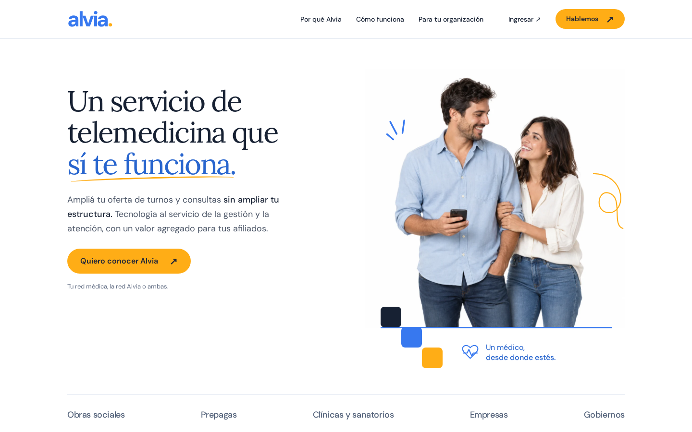

# Base visual aprobada de V5

Capturas y comprobaciones conservadas para comparar futuras iteraciones sin depender de `/tmp`.

- Fecha de captura: 2026-09-12.
- Página: `https://alvia.ar/v5/`.
- Runtime: `c2817c16b87c28a2235a03433018047e4e725fbe`.
- Referencia de mensaje y estilo: [v5/DESIGN.md](../../../v5/DESIGN.md).
- Navegador: Chromium mediante Playwright. Los anchos móviles comprueban layout; no representan una prueba en hardware iPhone/Android.

| Captura | Viewport | Uso |
|---|---|---|
| [Hero de escritorio](desktop-hero.png) | 1440 × 900 | Tipografía, proporción de columnas, foto, CTA y franja de segmentos. |
| [Página de escritorio](desktop-full.png) | 1440 px de ancho | Secuencia, fondos, espaciado y relación entre bloques. |
| [Hero móvil](mobile-hero.png) | 390 × 900 | Orden texto/CTA/foto y escala de lectura. |
| [Página móvil](mobile-full.png) | 390 px de ancho | Apilado de bloques, controles y extensión del recorrido. |

## Comprobaciones conservadas

- [browser-checks.json](browser-checks.json): 146 comprobaciones sobre la URL pública; anchos 1440, 1024, 768, 390 y 320, más estados sin JavaScript y con movimiento reducido.
- [home-routing.json](home-routing.json): ambas raíces en origen y Cloudflare redirigen a V5; V5 y V4 directa responden 200.
- [home-browser.json](home-browser.json): llegada desde `alvia.ar` en escritorio y `www.alvia.ar` en móvil, después de promover la portada.

Los JSON son resultados de verificación, no un runner de tests. El directorio conserva evidencia de esta versión; no se publica dentro de `/v5/` y no debe sobrescribirse con capturas de una iteración posterior. Para una nueva base aprobada, crear otro directorio identificado por versión o fecha.
